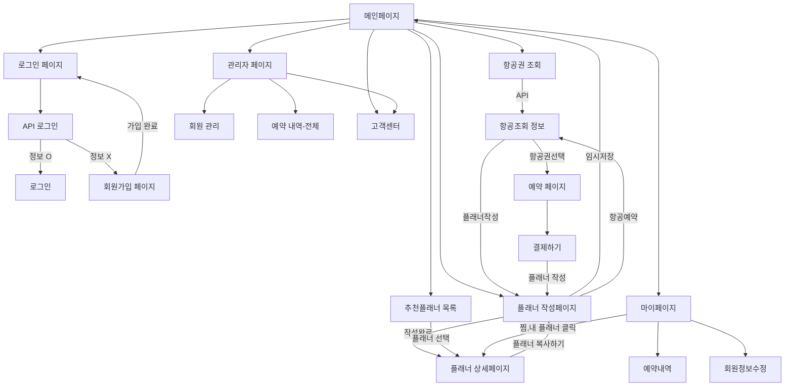

# rego
여행 계획 및 항공,호텔 예약

```mermaid
flowchart TD
    A[메인페이지] --> B[로그인 페이지]
    B --> C[API 로그인]
    C --> |정보 O| D[로그인]
    C --> |정보 X| E[회원가입 페이지]
    A --> F[항공권 조회]
    E --> |가입 완료| B
    F --> |API| G[항공조회 정보]
    A --> I
    G --> |항공권선택| H[예약 페이지]
    G --> |플래너작성| I[플래너 작성페이지]
    I --> |임시저장| A
    I --> |작성완료| J[플래너 상세페이지]
    I --> |항공예약| G
    A --> K[추천플래너 목록]
    K --> |플래너 선택| J
    J --> |플래너 복사하기| I
    A --> L[관리자 페이지]
    L --> M[회원 관리]
    L --> N[예약 내역-전체]
    A --> O[마이페이지]
    O --> P[예약내역]
    O --> R[회원정보수정]
    A --> Q[고객센터]
    H --> S[결제하기]
    S --> |플래너 작성| I
    O --> |찜,내 플래너 클릭| J
    L --> Q
```